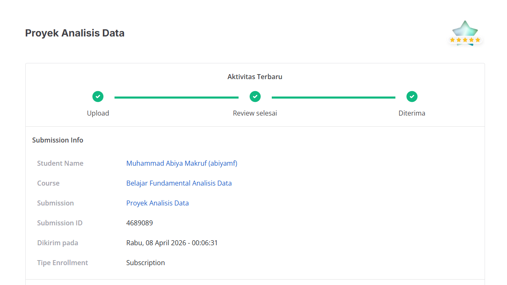
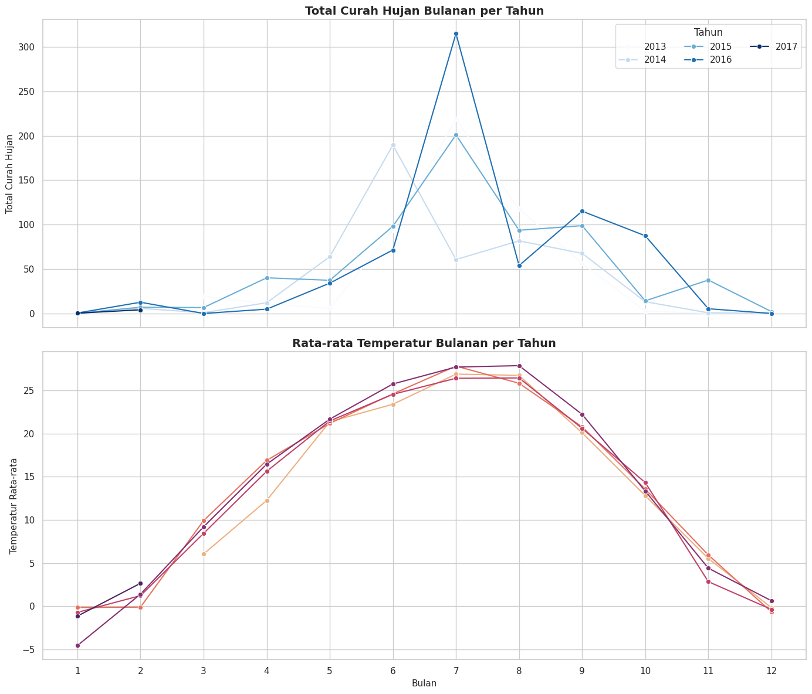
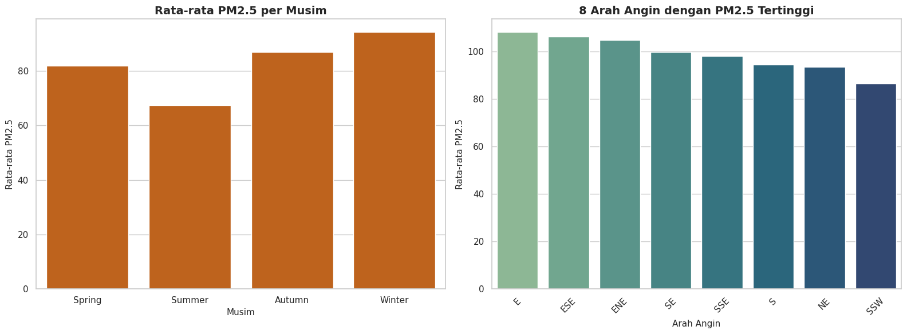
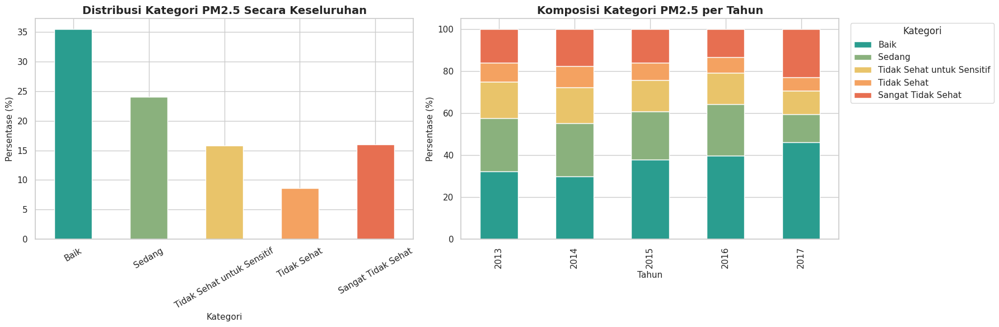

# Project Tugas Dicoding Course `Kelas Belajar Fundamental Analisis Data`

Project ini merupakan submission analisis data menggunakan **Air Quality Dataset** pada stasiun **Aotizhongxin**. Fokus project adalah mengolah data kualitas udara, melakukan exploratory analysis di notebook, lalu menyajikan hasilnya kembali melalui dashboard Streamlit.

## Bukti Penilaian

Berikut bukti penilaian project dengan hasil **bintang 5**:



## Tentang Project

Analisis pada project ini berfokus pada tiga pertanyaan bisnis berikut:

1. Pada bulan apa curah hujan tertinggi terjadi setiap tahun, dan bagaimana pola temperatur bulanan berubah sepanjang periode pengamatan?
2. Kapan tingkat polusi `PM2.5` cenderung lebih tinggi jika dilihat dari musim dan arah angin?
3. Bagaimana distribusi kategori kualitas udara berbasis `PM2.5`, dan seberapa sering kondisi tidak sehat muncul pada tiap tahun?

Output utama project:

- Notebook analisis: `Proyek_Analisis_Data.ipynb`
- Dashboard interaktif: `dashboard/dashboard.py`

## Struktur Project

```text
.
├── Proyek_Analisis_Data.ipynb
├── dashboard/
│   ├── dashboard.py
│   └── all_data.csv
├── data/
│   └── PRSA_Data_Aotizhongxin_20130301-20170228.csv
└── readme/
    ├── graphic_1.png
    ├── graphic_2.png
    ├── graphic_3.png
    └── penilaian_proyek.png
```

## Hasil Visualisasi Pertanyaan Bisnis

### Pertanyaan Bisnis 1

Visualisasi pola curah hujan dan temperatur bulanan:



### Pertanyaan Bisnis 2

Visualisasi pola polusi `PM2.5` berdasarkan musim dan arah angin:



### Pertanyaan Bisnis 3

Visualisasi distribusi kategori kualitas udara berbasis `PM2.5`:




## Cara Menjalankan Project

### Setup environment dengan uv

```bash
uv init .
uv add pandas matplotlib seaborn streamlit jupyter nbformat
```

### Menjalankan notebook

```bash
uv run jupyter notebook
```

Setelah Jupyter terbuka, buka file `Proyek_Analisis_Data.ipynb`.

### Menjalankan dashboard Streamlit

```bash
uv run streamlit run dashboard/dashboard.py
```

## Deploy ke Streamlit Cloud

1. Push repository ini ke GitHub.
2. Buat app baru di Streamlit Cloud.
3. Pilih repository dan branch yang berisi project ini.
4. Gunakan entrypoint `dashboard/dashboard.py`.
5. Pastikan dependensi diambil dari `pyproject.toml` atau `requirements.txt`.
